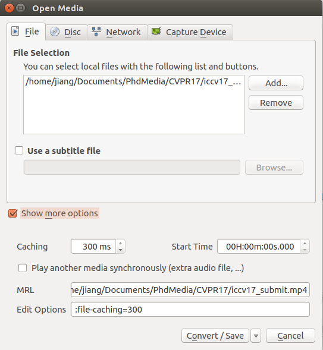

#**How To Compress Your High Quality Video**

1. Install VLC video player ([link](http://www.videolan.org/vlc/index.html)).

2. Launch VLC Player -> Media -> Convert/Save ...
    or Launch VLC Player -> Ctrl + R
    
 	
    
3. Add the video -> Click Show more options -> Change Caching time (300ms is normally good).

	
	
	** -> Click Convert/Save**
	 
	
	
4.  **THIS STEP IS VERY IMPORTANT !!!**
	Select the video resolution that you want (i.e. MPEG4 1080p, Youtube HD, etc.)
	
	
	
	Click on detail setting to define your video sampling rate properly. 
	
	
	
5. Setting the good parameters.
	**This step can reduce your video size DRAMATICALLY**. 
	Normally, 3500 kb/s has quite high quality. When you need to submit your video as subplementary materials. You can try to change to smaller values according to the submission size limits. In the quite extreme case, you are allowed to submit a less than 10M file (like IROS), you can set the Bitrate as 900 kb/s. **With such setting, to my experience, a video of 90 seconds of MPEG4 1080p can be compressed as less than 10M.**
	
	
	
6. Last step, set the path of the compressed file, **remember to name it different from the source video**. Then you can start the compressing. 

	
	
7. See an example awesome compression of a 1080p HD Video. Before compression, the raw video (output of OpenShot video maker) has size of **1.8G**, now the compressed video has** only 164M**. Trust me, the quality is still very high.
	
	