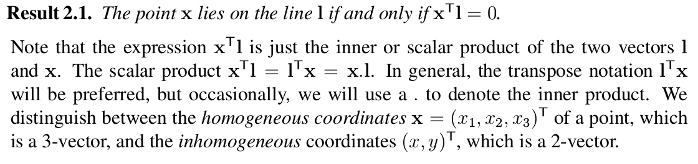
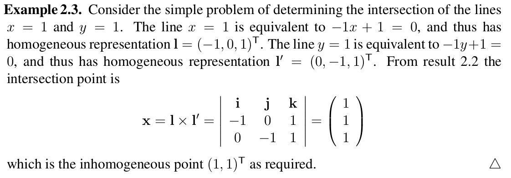

# Engineering/implementation skills in Computer Vision

- **Direct Feature Similarity Estimation**
	Normalized Color Distance using image gradient ([Detecting and tracking multiple moving objects using temporal integration](http://www.cse.huji.ac.il/~peleg/papers/eccv92-Irani-Integration.pdf)).
	
	
- **Epipolar Constraints of Image/Feature Pairs**
	Compute the epipolar consistancy of matching pairs between two images, such that moving object features or noisy matching pairs can be detected. ([ Detecting Motion Regions in the Presence of a Strong Parallax from a Moving Camera by Multiview Geometric Constraints](http://iris.usc.edu/Vision-Users/OldUsers/cyuan/pami06-draft.pdf))
	
	
- **Homogeneous Representation**
	Inhomogeneous representation (Euclidean coordination representation) cannot represent points/lines at infinity. However, homogeneous coordinate can handle this problem in an very elegant manner. Follows are some tricks that how Homogeneous coordinate tackles the problems of inhomogeneous coordinate. (Detailed in Chapter 2 of Multiple View Geometry in Computer Vision by Richard Hartley.)

	**The key difference between a projective and affine transformation is that the vector *v* is not null for a projectivity. This is responsible for the non-linear effects of the projectivity. Affine transformation perserves infinity, while projective transformation does NOT.  Also, inhomogeneous coordinate can NOT projective transformation problem.**
	
	