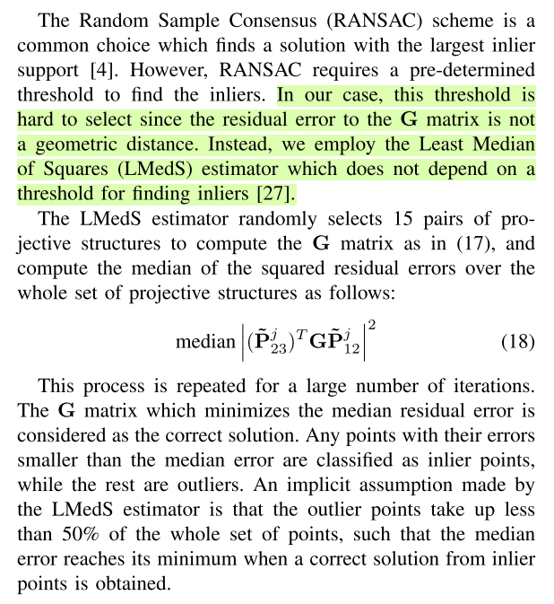

# Robust Estimation

1. **Good matching pairs selection** using robust estimation
	
	Paper MLESAC: A new robust estimator with application to estimating image geometry([paper](https://www.robots.ox.ac.uk/~vgg/publications/2000/Torr00/torr00.pdf), [Matlab Toolbox](http://graphics.cs.msu.ru/en/science/research/machinelearning/ransactoolbox))

2. **Least Median Squares Estimation and Estimators**

	LMedS algorithm is use in this PAMI paper: [Detecting Motion Regions in the Presence of a Strong Parallax from a Moving Camera by Multiview Geometric Constraints](http://citeseerx.ist.psu.edu/viewdoc/download?doi=10.1.1.73.9563&rep=rep1&type=pdf)

	[Simple Explanation and Example in Computer Vision](http://homepages.inf.ed.ac.uk/rbf/CVonline/LOCAL_COPIES/AV0405/HEWARD/LeastMedianSquares.html)