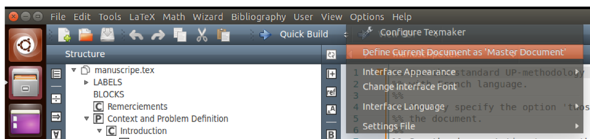
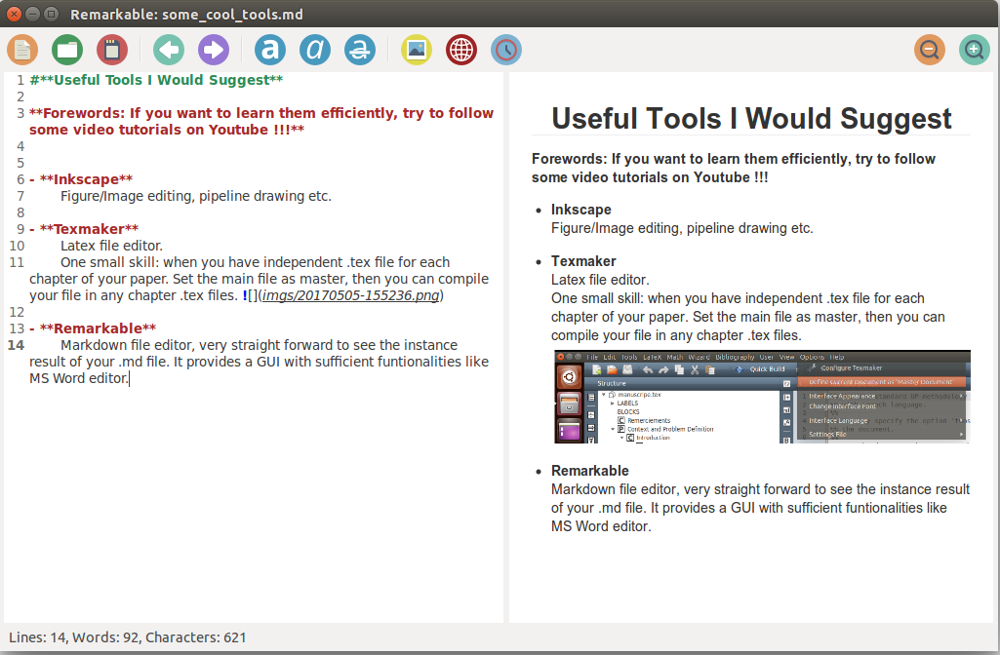

# **Useful Tools I Would Suggest**

**Forewords: If you want to learn them efficiently, try to follow some video tutorials on Youtube !!!**

- **Inkscape** 
	Figure/Image editing, pipeline drawing etc.
	
- **Texmaker**
	Latex file editor. 
	One small skill: when you have independent .tex file for each chapter of your paper. Set the main file as master, then you can compile your file in any chapter .tex files. 
	
- **Remarkable**
	Markdown file editor, very straight forward to see the instance result of your .md file. It provides a GUI with sufficient funtionalities like MS Word editor.
	
- **Mendeley**
	Software for literature review paper management, details in lit_Review_Tools.md file.

- **Universite de Bourgogne PhD Thesis Template**
	Updated latex template ([link](http://www.multiagent.fr/ThesisStyle#Style_for_UB)).
	Some thesis writing skills ([link](https://github.com/CansenJIANG/mustReadPapers/blob/master/PhD_Thesis_Writing_Skills.pdf)).

- **KLT  Feature Tracker Implementation**
	A very nice implementation of KLT feature tracking algorithm tutorial with codes in Matlab, C++, Java, GPU ([link](http://cecas.clemson.edu/~stb/klt/)).
	
- **Kazam Screencaster**
	Kazam is a simple screen recording program that will capture the content of your screen and record a video file that can be played by any video player that supports VP8/WebM video format ([link](https://launchpad.net/kazam)).
	
- **OpenShot**
	OpenShot Video Editor is a free and open-source video editor for FreeBSD, Linux, macOS, and Windows. The project was started in August 2008 by Jonathan Thomas, with the objective of providing a stable, free, and friendly to use video editor. OpenShot's core video editing functionality is implemented in a C++ library, libopenshot. OpenShot uses the Qt toolkit and offers a Python API ([link](http://www.openshot.org/)).
