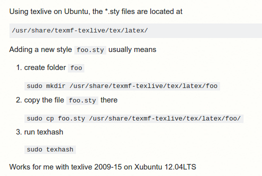

# **Useful Tools I Would Suggest**

**Forewords: If you want to learn them efficiently, try to follow some video tutorials on Youtube !!!**


- **Inkscape** 
	Figure/Image editing, pipeline drawing etc.
	
- **Texmaker**
	Latex file editor. 
	One small skill: when you have independent .tex file for each chapter of your paper. Set the main file as master, then you can compile your file in any chapter .tex files. 
	
	**Define your own latex style template.**
	For example, when you write your PhD thesis, there are a lot of *.sty .cls* files that you need to included to your *main.tex* file. To manage these files in an elegant maner, you can add them to your system configuration folder. In linux, see [this tutorial](https://tex.stackexchange.com/questions/1137/where-do-i-place-my-own-sty-or-cls-files-to-make-them-available-to-all-my-te). Or the following image, which works well for me (Cansen). Be careful, **.cfg .def** files should be in the same folder of the *main.tex* file. Some more skills, when you manage a lot of chapters of your thesis, you can create multiple independent *chapters.tex* files, then you use the command "*\include{chapters}*" or "*\input{chapters}*". "*\include{...}*" starts the content from a new page, while "*\input{...}*" continue the content.
	
	
	
- **Remarkable**
	Markdown file editor, very straight forward to see the instance result of your .md file. It provides a GUI with sufficient funtionalities like MS Word editor.
	
- **Mendeley**
	Software for literature review paper management, details in lit_Review_Tools.md file.

- **Universite de Bourgogne PhD Thesis Template**
	Updated latex template ([link](http://www.multiagent.fr/ThesisStyle#Style_for_UB)).
	Some thesis writing skills ([link](https://github.com/CansenJIANG/mustReadPapers/blob/master/PhD_Thesis_Writing_Skills.pdf)).

- **KLT  Feature Tracker Implementation**
	A very nice implementation of KLT feature tracking algorithm tutorial with codes in Matlab, C++, Java, GPU ([link](http://cecas.clemson.edu/~stb/klt/)).
	
- **ViBe: Video Background Extractor**
	An implementation of ViBe for static or small motion video background subtraction algorithm ([TIP paper (900 citations)](http://orbi.ulg.ac.be/bitstream/2268/157176/1/VanDroogenbroeck2014ViBe.pdf), [C++ codes](http://www.telecom.ulg.ac.be/research/vibe/)). 
=======
- **Kazam Screencaster**
	Kazam is a simple screen recording program that will capture the content of your screen and record a video file that can be played by any video player that supports VP8/WebM video format ([link](https://launchpad.net/kazam)).
	
- **RecordMyDesktop**
	RecordMyDesktop is an alternative software to Kazam Screencaster. I (Cansen) use it all the time, it can be download directly using Ubuntu Software Center (or [this link](https://apps.ubuntu.com/cat/applications/quantal/gtk-recordmydesktop/)).
	
- **OpenShot Video Maker**
	OpenShot Video Editor is a free and open-source video editor for FreeBSD, Linux, macOS, and Windows. The project was started in August 2008 by Jonathan Thomas, with the objective of providing a stable, free, and friendly to use video editor. OpenShot's core video editing functionality is implemented in a C++ library, libopenshot. OpenShot uses the Qt toolkit and offers a Python API ([link](http://www.openshot.org/)).
	
- **Okular PDF Reader**
	A very handy PDF reader for Linux that you can do freely anotations, just like Adobe PDF Reader in Windows. You can install directly from Ubuntu Software Center (or [this link](https://apps.ubuntu.com/cat/applications/precise/okular/)).
	
- **Gnuplot**
	Gnuplot is a portable command-line driven graphing utility for Linux, OS/2, MS Windows, OSX, VMS, and many other platforms. The source code is copyrighted but freely distributed (i.e., you don't have to pay for it). It was originally created to allow scientists and students to visualize mathematical functions and data interactively, but has grown to support many non-interactive uses such as web scripting.  ([link](http://gnuplot.sourceforge.net/)).

- **VLC Player for Video Compression**
	Check [this tutorial](https://github.com/Le2iCollaborativeResearchGroup/Utilities/blob/master/Compress_Your_Video.md) if you need to compress your video with High Quality.
	
- **Presentation with Video using Ubuntu**
	
	It is very easy to link your video with your presentation using PDFPC tool ([link](https://github.com/pdfpc/pdfpc)). The link contains a detailed installation guide. 
	
	Follow is an example how to integrate your video with your Latex beamer file:
```
 	\begin{frame}{PDF Video Example}
	\frametitle{PDF Video Example}
	\href{run:videos/Video.avi?loop}
	{\includegraphics[width=1.0\paperwidth,height=0.5\paperwidth]{images/CoverImage.png}}
	\centering
	This is the caption of example video
	\end{frame}
```

	To do the presentation, **open a terminal (Ctrl+T)**, then use the following command:
	
```
	$ pdfpc myslides.pdf
```

	NOTE: if you have very heavy video, you might need to wait for the video buffering.
	
- **Image Segmentation using Unsupervised Watershed**
Image Segmentation using Unsupervised Watershed Algorithm with an Over-segmentation Reduction Technique ([Tutorial with C++ code](https://www.codeproject.com/Articles/751744/Image-Segmentation-using-Unsupervised-Watershed-Al)).